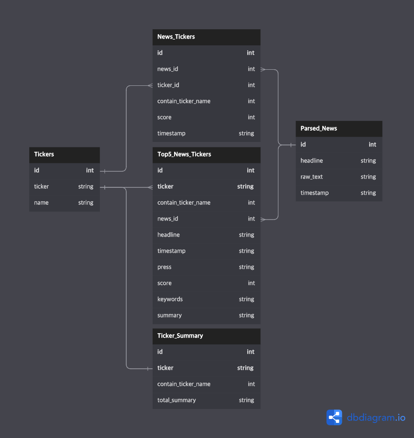
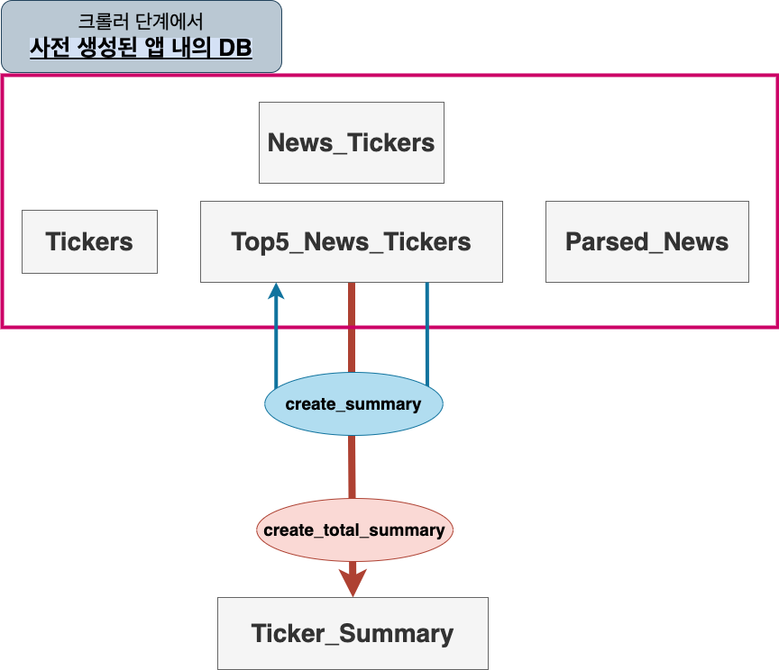

# 창의적 통합 설계- 뉴스 요약문 생성(2023-1)

#### <a href="https://drive.google.com/file/d/1pvuxsqytqpP6Uz4uRZOcaNP6_1uoSrK_/view?usp=sharing" target="_blank"> 보고서 </a>

#### <a href="https://drive.google.com/file/d/1HrGzsiuDWEtxJ3q58u-X7A9GezY9RCIS/view?usp=drive_link" target="_blank"> 모델 파일 </a>


```bash
.
├── README.md
├── example.py
├── demo_create_summary.ipynb
├── demo_create_total_summary.ipynb
├── demo_extract_keyword.ipynb
└── summary
    ├── extract_keyword.py
    ├── create_summary.py
    ├── create_total_summary.py
    ├── data
    │   └── stopwords-ko.txt
    └── model
        └── model.pt
```
# 모듈화 한 함수 적용
## 키워드 추출

### 사전 설정
```python
# 경로는 위치에 맞게 적절히 import
from .summary.extract_keyword import create_stopword_set
from .summary.extract_keyword import get_keywords_top5

stopword_path = "./summary/data/stopwords-ko.txt"
stopwords = create_stopword_set(stopword_path)
```
### 함수 호출
```python
keyword = get_keywords_top5(input_text, stopwords)
```

#### Input

```input_text``` : 기사 원문 string

```stopwords``` : 사전 정의된 create_stopword_set(stopword_path) 의 결과 Class

#### Output
아래와 같은 공백으로 구분된 하나의 string

```python
'반도 카카오 전망 효과 인수'
```

## 요약문 생성

### 사전 설정

#### 미리 model, tokenizer, device 를 불러오는 이유는 for 문을 돌 때 매번 build 하지 않고
#### 한번만 build 를 하고 이미 빌드된 모델을 함수 인자로 넣어서 재사용 하기 위함이다.

```python
# 경로는 위치에 맞게 적절히 import
import torch
from transformers import AutoTokenizer, BartForConditionalGeneration

# 키워드가 Input으로 같이 들어간다
# 실제 앱 내의 DB에서는 생성된 keyword field의 값을 바로 불러오면 된다.
from summary.extract_keyword import create_stopword_set
from summary.extract_keyword import get_keywords_top5

from summary.create_summary import create_summary

stopword_path = "./summary/data/stopwords-ko.txt"
stopwords = create_stopword_set(stopword_path)

# device setting
device = torch.device("cuda" if torch.cuda.is_available() else "cpu")

# 사전 학습된 요약 모델 load
model_path = "./summary/model/model.pt"
model = BartForConditionalGeneration.from_pretrained("gogamza/kobart-base-v2")
model.load_state_dict(torch.load(model_path, map_location=torch.device(device)))
model.to(device)
model.eval()

# 사전 학습된 tokenizer load
tokenizer = AutoTokenizer.from_pretrained('gogamza/kobart-base-v2')
```
### 함수 호출
```python
summary = create_summary(input_text, keyword_list, model, tokenizer, device)
```

#### Input

```input_text``` : 기사 원문 string

```keyword_list``` : 기사 원문의 keyword list, 반드시 ```['단어1', '단어2', ...]``` 형태의 list 여야 한다.

```model``` : 사전 학습한 model

```tokenizer``` : 사전 학습한 tokenizer

```device``` : 현재 장치의 device Type


#### Output
아래와 같은 하나의 string

```python
'국내 증시는 반도체와 전자부품을 추천하며 6월 증시도 강세가 이어질 것으로 예상되고 있으며 삼성전자 또한 하반기 본격적인 시너지가 나타날 것이라는 전망이 나왔다.'
```

## 최종 그룹화 후 전체 요약문 생성

### 사전 설정

#### 미리 model, tokenizer, device 를 불러오는 이유는 for 문을 돌때 매번 build 하지 않고
#### 한번만 build 를 하고 이미 빌드된 모델을 함수 인자로 넣어서 재사용 하기 위함이다.

```python
# 경로는 위치에 맞게 적절히 import
import torch
from transformers import AutoTokenizer, BartForConditionalGeneration
from sentence_transformers import SentenceTransformer

from summary.create_total_summary import create_total_summary

# device setting
device = torch.device("cuda" if torch.cuda.is_available() else "cpu")

# 사전 학습된 요약 모델 load
model_path = "./summary/model/model.pt"
model = BartForConditionalGeneration.from_pretrained("gogamza/kobart-base-v2")
model.load_state_dict(torch.load(model_path, map_location=torch.device(device)))
model.to(device)
model.eval()

# 사전 학습된 tokenizer load
tokenizer = AutoTokenizer.from_pretrained('gogamza/kobart-base-v2')

# 사전 학습된 BERT model load
bert_model = SentenceTransformer('jhgan/ko-sbert-sts')
bert_model.to(device)
```
### 함수 호출
```python
total_summary = create_total_summary(summary_list, bert_model, model, tokenizer)
```

#### Input

```summary_list``` : 기사 원문의 요약 문장의 list, 반드시 ```['요약문장1', '요약문장2', ...]``` 형태의 list 여야 한다.

```bert_model``` : 사전 학습한 그룹화 판별 model 

```model``` : 사전 학습한 요약문 생성 model

```tokenizer``` : 사전 학습한 tokenizer

#### Output
아래와 같은 하나의 string

```python
'''미국 젊은이들이 틱톡에 푹 빠져있으며 특히 젊은 층에서 인기가 높아지면서 폭발적인 성장세를 보이고 있는 더우인의 글로벌 버전인 '틱 톡'이 출시되면서 주목을 받고 있다. 중국
정부가 신에너지자동차 보조금을 중단하면서 기존 전략을 고수하기 어려워졌고 이에 따라 CATL은 해외 생산시설 확충과 함께 판매망을 확대하고 있으며 하지만 미국 의회 일각에선 중국의
우회 전략으로 IRTA의 보조금 지원을 받는다고 비난하고 있어 무산될 가능성도 있다. S&P500은 올해 12% 상승했지만 소수 빅테크 기업의 주가를 제외하면 여전히 마이너스
상태이며 특히 최근 고점에서 20% 이상 주가가 하락할 경우를 베어마켓으로 규정한다. 미국 피츠버그 대학 의대 트리크 파스코알 교수 연구팀이 뇌 신경세포를 돕는 보조 세포인
성상세포와 알츠하이머 치매의 연관성을 밝혀냈다.'''
```


# 현재 DB 구조 문제점

```python
tickerobj = NewsTickers.objects.using('news').filter(ticker_id=findid,
contain_ticker_name__in=ticker_name_selector).order_by('-timestamp', '-score').values('news_id')[:5]
newsids = []
for i in tickerobj:
  newsids.append(i['news_id'])
  newsobj = ParsedNews.objects.using('news').filter(id__in=newsids).order_by('-timestamp').values()
```

전체 데이터에 대해 검색과 스코어 기준 정렬을 매번 한다.

따라서 동일 Ticker 에 대해 여러 반복 요청이 들어올 경우 매번 각 Table을 검색하는 상태이다.

-------------------------------

# Suggestion

아래와 같은 Top5_News_Tickers 를 크롤링 단계에서 미리 생성

추후 요약문 생성을 위해서도 필요함

 contain_ticker_name -> contains_stock_name 으로 변경



-------------------------------

# 과정



1. 기준 시간 지나면 news 크롤링
2. 크롤링 된 news들 Parsed_News 에 저장

(위 순서 까지는 기존에 존재하는 코드)

3. 개별 news score 계산
4. Ticker 별 score 상위 최대 5개 news_id 산출
5. 해당 Ticker의 Top5_News_Tickers 에 존재하는 news_id 목록과 비교
6. 일치하는경우 새로운 DB를 만들지 않고 해당 Ticker skip
7. ```[1,2,3,5,6]``` , ```[1,2,6,7,8]``` 같이 일부만 겹치는 경우 ```[3,5]``` 삭제 -> ```[7, 8]``` 추가
8. 새로 추가된 Column 에 대해서는 ```keywords```, ```summary``` 는 ```null``` 인 상태
9. ```extrac_keyword``` 함수와 ```create_summary``` 함수로 Top5_News_Ticker 의 ```keywords```, ```summary``` field 생성 / 업데이트
10. ```create_total_summary``` 함수로 모든 Ticker에 대해 Top5 DB 를 불러와 Ticker-Summary 생성 / 업데이트


----------------------------------------
